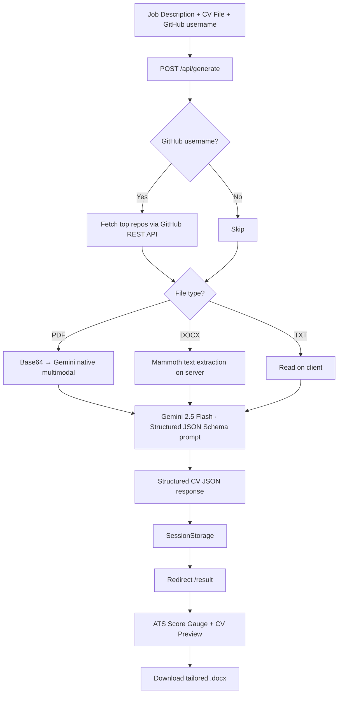

# CVEarly — AI-Powered CV Optimizer

<div align="center">


[](LICENSE)
[](https://nextjs.org/)
[](https://react.dev/)
[](https://www.typescriptlang.org/)

**Paste a job description, upload your CV — get an ATS-optimized Word document back in seconds.**

[Live Demo](https://cvearly.vercel.app) · [Report Bug](.github/ISSUE_TEMPLATE/bug_report.md) · [Request Feature](.github/ISSUE_TEMPLATE/feature_request.md)

</div>

---

## What it does

CVEarly analyzes a job description and your existing CV using **Google Gemini AI**, then generates a clean, recruiter-ready `.docx` file tailored to that specific role — complete with an ATS compatibility score and keyword gap analysis.

---

## ✨ Features

| Feature | Description |
|---|---|
| **ATS Score Gauge** | Animated circular dial showing your match %, hygiene checklist, and keyword gap analysis |
| **Multi-format CV parsing** | PDF (native Gemini multimodal), DOCX (server-side via Mammoth), TXT |
| **GitHub Integration** | Fetches your top starred repos, translates commit history into recruiter-ready achievements |
| **Word Document Export** | Client-side `.docx` generation via the `docx` library — no server upload of your final CV |
| **Structured AI Output** | Gemini 2.5 Flash with enforced JSON Schema — no hallucinated free-text output |

---

## 🛠 Tech Stack

| Layer | Technology |
|---|---|
| Framework | Next.js 16 (App Router) + React 19 |
| Styling | Tailwind CSS v4 |
| Animations | Framer Motion |
| AI Engine | Google Gemini 2.5 Flash (`@google/genai`) |
| Document | `docx` (browser-side DOCX generation) |
| Parser | `mammoth` (DOCX text extraction, server-side) |
| Language | TypeScript 5 (strict) |

---

## 📋 Pipeline



---

## ⚙️ Local Setup

### Prerequisites

- Node.js `>=18`
- A free [Google Gemini API key](https://aistudio.google.com/)

### 1. Clone & install

```bash
git clone https://github.com/ivancidev/cvearly.git
cd cvearly
npm install --legacy-peer-deps
```

> `--legacy-peer-deps` resolves React 19 peer dependency conflicts.

### 2. Environment variables

```bash
cp .env.example .env.local
```

```env
# .env.local
GEMINI_API_KEY=AIzaSy...your_key
```

### 3. Run

```bash
npm run dev
# → http://localhost:3000
```

---

## 🔬 Quality

```bash
npm run lint        # ESLint
npm run type-check  # TypeScript (tsc --noEmit)
npm run build       # Next.js production build
```

Every push and PR triggers the full CI pipeline automatically via [GitHub Actions](.github/workflows/ci.yml).

---

## 🤝 Contributing

Contributions are welcome! See [CONTRIBUTING.md](CONTRIBUTING.md) for setup, branching, and code standards.

---

## 📄 License

[MIT](LICENSE) © 2025 CVEarly
